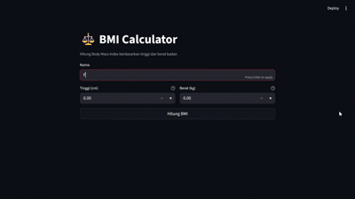
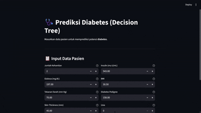
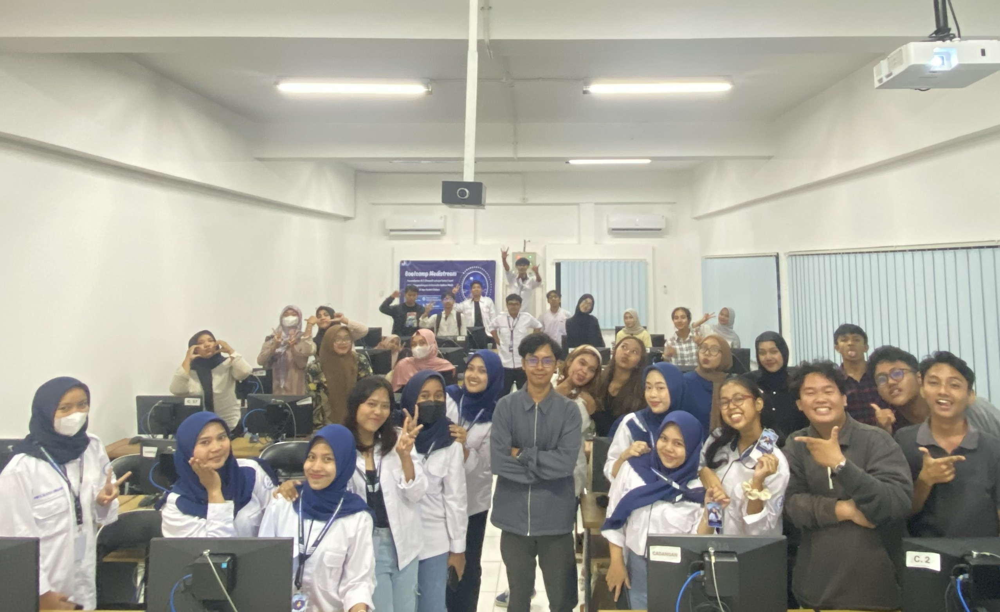

# Bootcamp: AI & Streamlit for Medical Informatics

A hands-on bootcamp designed to equip students with end-to-end skills in building medical AI systems, from data processing and machine learning modeling to web deployment using Streamlit.

## Overview

This bootcamp introduces the complete pipeline of medical AI development, enabling participants to transform healthcare data into intelligent, deployable applications.

Key capabilities developed in this bootcamp include:

- Medical data processing and analysis
- Machine learning model development and evaluation
- Interactive web application development using Streamlit
- Deployment of AI models

## Learning Outcomes

Based on the bootcamp modules, participants are expected to:

- **M1 (15%)**: Perform data exploration and preprocessing
- **M2 (25%)**: Build and evaluate machine learning models
- **M3 (30%)**: Develop web-based applications using Streamlit
- **M4 (30%)**: Deploy machine learning models into web applications

## Bootcamp Sessions

### 1. **Session 1 – Environment Setup**  
Installation and configuration of tools and libraries

### 2. **Session 2 – Data Preprocessing**  
Data cleaning, normalization, and dataset splitting using Pima Indians Diabetes Dataset

### 3. **Session 3 – Machine Learning Modeling**  
Model training and evaluation using algorithms such as Decision Tree

### 4. **Session 4 – Web Development & Deployment**  
Building and deploying ML models using Streamlit

## Practice

### 1. BMI Calculator (Streamlit App)
A simple web-based application to calculate Body Mass Index (BMI).

**Features:**
- Input height and weight
- Automatic BMI calculation
- Health category classification

**Preview:**
<p align="left">
  
</p>

### 2. Diabetes Prediction (Machine Learning + Streamlit)

A machine learning-based system to predict diabetes using the **Pima Indians Diabetes Dataset**.

**Dataset Source:**
https://www.kaggle.com/datasets/uciml/pima-indians-diabetes-database

**Pipeline:**
Data → Preprocessing → Feature Scaling → SMOTE → Model Training → Evaluation → Deployment

**Techniques Used:**
- Data Cleaning (handling zero as missing values)
- Feature Scaling (StandardScaler)
- Imbalanced Handling (SMOTE)
- Model: Decision Tree
- Evaluation: Accuracy, Classification Report (Precision, Recall, F1-Score), Confusion Matrix, ROC-AUC

**Output:**
- Binary classification (Diabetes / Non-Diabetes)
- Prediction probability (confidence score)

**Preview:**
<p align="left">
  
</p>

## Repository Structure

```
bootcamp-medical-ai-streamlit/
│
├── modules/                  # Bootcamp materials (PDF: slides)
│
├── assets/                   # Visual assets (app previews & documentation)
│
├── practice/                 # Hands-on practice projects
│   ├── bmi-calculator/
│   │   ├── app.py            # Streamlit app for BMI calculation
│   │   ├── requirements.txt  # Project-specific dependencies
│   │   └── README.md         # Documentation for BMI project
│   │
│   └── diabetes-prediction/
│       ├── app.py            # Streamlit app for diabetes prediction
│       ├── data/             # Dataset (Pima Indians Diabetes Dataset)
│       ├── models/           # Trained model and scaler (joblib files)
│       ├── notebook/         # Experiment and model training notebook
│       ├── requirements.txt  # Project-specific dependencies
│       └── README.md         # Documentation for diabetes project
│
├── README.md                 # Main documentation for the bootcamp
└── .gitignore                # Files ignored by Git (venv, cache, etc.)
```

## Technologies Used

- Python
- Pandas
- NumPy
- Matplotlib
- Streamlit
- Scikit-learn
- Imbalanced-learn (SMOTE)
- Joblib

## How to Run

### 1. Clone repository:
```bash
git clone https://github.com/Falrlz/bootcamp-medical-ai-streamlit.git
```

### 2. Create Virtual Environment
**Windows:**
```bash
python -m venv venv
venv\Scripts\activate
```

**MacOS / Linux**:
```bash
python3 -m venv venv
source venv/bin/activate
```
### 3. Navigate to Project Directory
```bash
cd practice/bmi-calculator
# or
cd practice/diabetes-prediction
```

### 4. Install dependencies:
```bash
pip install -r requirements.txt
```

### 5. Run App
```bash
streamlit run app.py
```

## Use Case

This bootcamp is designed to support:

* Medical Informatics Capstone Project (MICP)
* Internship (KP)
* Final Project (Bachelor’s Thesis)
* AI portfolio for healthcare domain

## Bootcamp Activities

<p align="left">
  
</p>

## Notes

* The dataset is used for educational purposes only
* The model is not intended for clinical diagnosis
* SMOTE is applied as a learning approach, not a clinical standard

## Speaker & Contributor

* Speaker: Muhammad Falah Akbar Al Faiz, S.Inf.Med. 
* Bootcamp organized by Medical Informatics Student Community (HMIM) Universitas Teknologi Yogyakarta

## Contribution

Contributions, improvements, and discussions are welcome to enhance the learning experience.